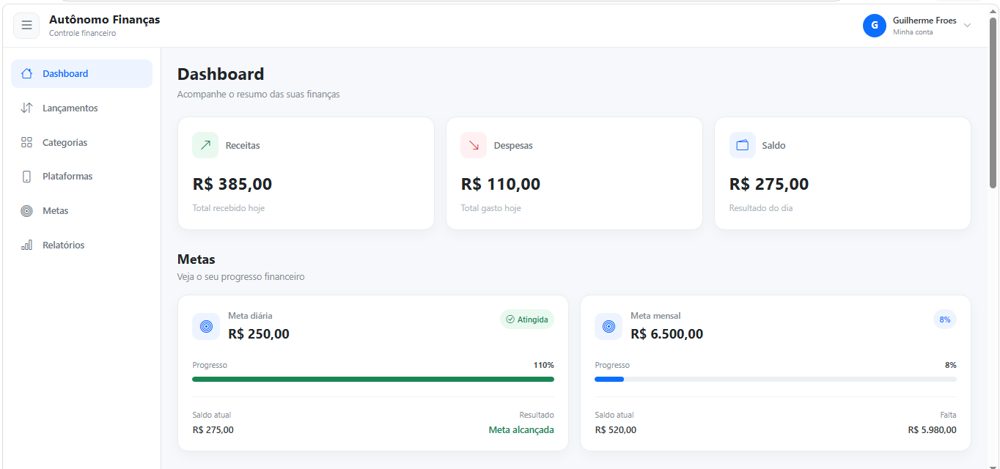
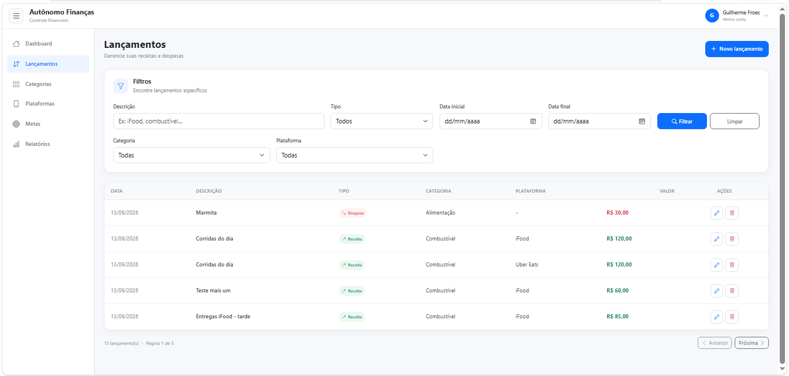
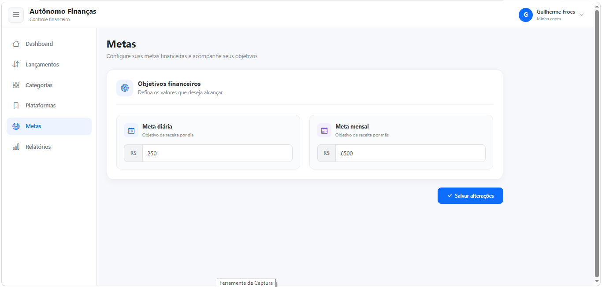
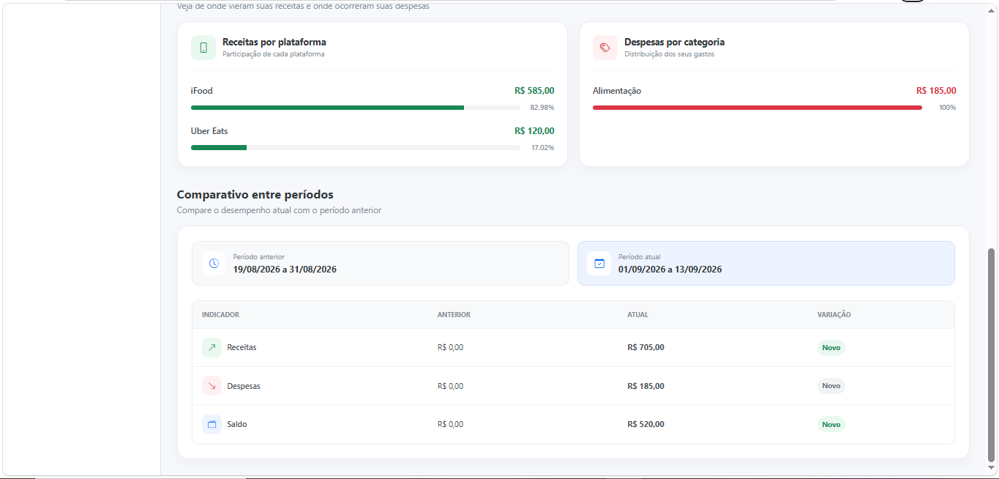

# 💰 Autônomo Finanças

Aplicação web full stack para controle financeiro de trabalhadores autônomos.

O **Autônomo Finanças** foi desenvolvido para facilitar o acompanhamento de receitas, despesas, metas e resultados financeiros do dia a dia, permitindo visualizar de forma simples se o trabalho está gerando lucro e acompanhar a evolução financeira ao longo do tempo.

O projeto surgiu a partir de uma necessidade real de profissionais que trabalham com diferentes plataformas e precisam centralizar seus ganhos e gastos em um único lugar.

## ✨ Principais funcionalidades

- 🔐 Cadastro e autenticação de usuários
- 🔑 Recuperação e redefinição de senha
- 🔄 Autenticação com Access Token e Refresh Token
- 💰 Controle de receitas e despesas
- 🗂️ Gerenciamento de categorias
- 📱 Gerenciamento de plataformas de trabalho
- 🎯 Definição de metas diárias e mensais
- 📊 Dashboard com indicadores financeiros
- 📈 Evolução financeira mensal
- 📋 Relatórios por período
- 📄 Exportação de relatórios em PDF
- 👤 Gerenciamento do perfil e alteração de senha

## 🛠️ Tecnologias utilizadas

### Frontend

- Angular 21
- TypeScript
- RxJS
- Bootstrap 5
- Bootstrap Icons
- Chart.js
- ng2-charts
- SCSS

### Backend

- Java 17
- Spring Boot 3
- Spring Web
- Spring Data JPA
- Spring Security
- OAuth2 Resource Server
- JWT
- Bean Validation
- Flyway
- Spring Mail
- OpenHTMLToPDF
- Maven

### Banco de dados

- PostgreSQL

### Ferramentas e desenvolvimento

- Git e GitHub
- Docker Compose
- VS Code
- pgAdmin
- Swagger / OpenAPI

## 🏗️ Arquitetura

O projeto utiliza uma arquitetura cliente-servidor, separando o frontend da API backend.

- **Frontend:** aplicação SPA desenvolvida em Angular, responsável pela interface e interação com o usuário.
- **Backend:** API REST desenvolvida com Spring Boot, responsável pelas regras de negócio, autenticação e acesso aos dados.
- **Banco de dados:** PostgreSQL, com versionamento da estrutura realizado pelo Flyway.
- **Autenticação:** baseada em JWT, utilizando Access Token e Refresh Token.
- **Comunicação:** o frontend consome os recursos do backend por meio de requisições HTTP para a API REST.

### Estrutura do projeto

```text
autonomo-financas/
├── backend/
├── docs/
│   ├── images/
│   ├── architecture.md
│   ├── backlog.md
│   ├── business-rules.md
│   └── product-vision.md
├── frontend/
├── .gitignore
├── docker-compose.yml
└── README.md
```

## 📸 Screenshots

### Dashboard

Visão geral das finanças, com receitas, despesas, saldo e acompanhamento das metas.



### Lançamentos

Gerenciamento de receitas e despesas, com filtros por período, tipo, categoria e plataforma.



### Metas

Configuração das metas financeiras diária e mensal.



### Relatórios

Análise das receitas por plataforma, despesas por categoria e comparação do desempenho entre períodos.



## 🚀 Como executar o projeto

### Pré-requisitos

Antes de começar, tenha instalado:

- Java 17
- Node.js e npm
- PostgreSQL
- Git

### 1. Clone o repositório

```bash
git clone https://github.com/guifroes1984/autonomo-financas.git
cd autonomo-financas
```

### 2. Configure o banco de dados

Crie um banco PostgreSQL para a aplicação.

As configurações locais do backend devem ser definidas no arquivo:

```text
backend/src/main/resources/application-local.properties
```

Exemplo:

```properties
spring.datasource.url=jdbc:postgresql://localhost:5432/autonomo_financas
spring.datasource.username=SEU_USUARIO
spring.datasource.password=SUA_SENHA

security.jwt.secret=SUA_CHAVE_JWT

spring.mail.username=SEU_EMAIL
spring.mail.password=SUA_SENHA_DE_APP

app.email.remetente=${spring.mail.username}
app.frontend.url=http://localhost:4200
```

> O arquivo `application-local.properties` contém configurações locais e informações sensíveis e não deve ser versionado no Git.

As migrations do Flyway são executadas automaticamente quando o backend é iniciado.

### 3. Execute o backend

Entre na pasta:

```bash
cd backend
```

Execute:

```bash
./mvnw spring-boot:run
```

A API ficará disponível em `http://localhost:8080`.

### 4. Execute o frontend

Em outro terminal:

```bash
cd frontend
npm install
npm start
```

A aplicação ficará disponível em `http://localhost:4200`.

### 5. Documentação da API

Com o backend em execução, a documentação Swagger/OpenAPI estará disponível em:

```text
http://localhost:8080/swagger-ui/index.html
```

## 🔐 Segurança e autenticação

A aplicação utiliza Spring Security com autenticação baseada em JWT.

O fluxo de autenticação foi estruturado com:

- **Access Token:** utilizado para autenticar as requisições à API e possui duração curta.
- **Refresh Token:** permite renovar o Access Token sem exigir um novo login do usuário.
- **BCrypt:** utilizado para armazenamento seguro das senhas.
- **Rotas protegidas:** os recursos financeiros da aplicação exigem autenticação.
- **Recuperação de senha:** realizada por meio de token temporário enviado por e-mail.
- **Revogação de sessão:** o Refresh Token é revogado no logout.

Os Refresh Tokens não são armazenados diretamente no banco de dados. A aplicação persiste apenas o **hash SHA-256** do token.

No frontend, um interceptor HTTP adiciona automaticamente o Access Token às requisições protegidas e tenta renovar a sessão quando a API retorna `401 Unauthorized`.

> Para uma futura evolução de segurança, o armazenamento do Refresh Token poderá ser migrado para cookies `HttpOnly`, `Secure` e `SameSite`.

## 📚 Documentação

O projeto possui documentação complementar disponível na pasta [`docs`](docs/):

- [Visão do produto](docs/product-vision.md)
- [Regras de negócio](docs/business-rules.md)
- [Arquitetura](docs/architecture.md)
- [Backlog](docs/backlog.md)

## 📌 Status do projeto

**MVP concluído.**

As principais funcionalidades planejadas para a primeira versão estão implementadas e validadas. O projeto está atualmente na etapa de preparação para publicação em ambiente de produção.

## 🔮 Próximas evoluções

Após a publicação da primeira versão, algumas melhorias poderão ser incorporadas ao projeto, como:

- Armazenamento do Refresh Token em cookie HttpOnly
- Rotação de Refresh Tokens
- Ampliação dos testes automatizados
- Novos indicadores e análises financeiras
- Melhorias de experiência em dispositivos móveis

## 👨‍💻 Autor

**Guilherme Henrique Froes**

Desenvolvedor de Software com foco em desenvolvimento Front-end com Angular e experiência na construção de aplicações integradas a APIs REST, além de conhecimentos em Java e Spring Boot.

Este projeto foi desenvolvido como aplicação prática e projeto de portfólio, contemplando desde a definição das regras de negócio até o desenvolvimento full stack e preparação para publicação.